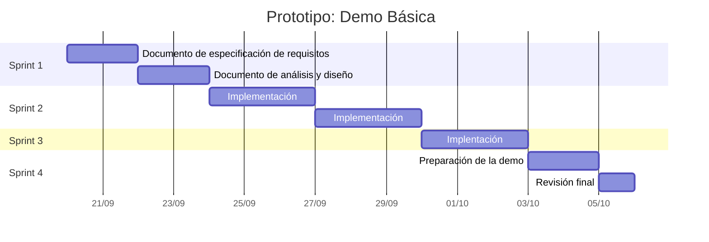

# Plan de proyecto

## Definición de roles

- Jefe de desarrolladores: André Román
- Desarrolladores:

	- Vilberto Patricio
	- André Román
	- Adrián Palacios
	- Pedro Sota
	- Óscar Macchiavello

## Lista de tareas

- [ ] Hacer el DER
- [ ] Hacer el DAD

	- [ ] Diseñar la interfaz (Adrián)

## Diagrama de Gantt

