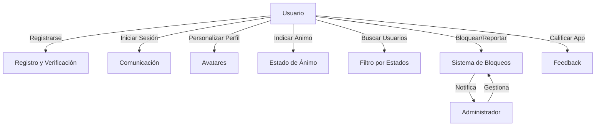

# Documento de Especificación de Requisitos

## Vista General

### Descripción General

PeerChat es una aplicación móvil desarrollada en Flutter que proporciona un espacio seguro para que los universitarios se conecten con amigos, brinden apoyo y compartan experiencias. La aplicación se enfoca en combatir la soledad y ayudar a que los estudiantes de primer año (cachimbos) se sientan acompañados. PeerChat promueve una comunidad positiva, donde los usuarios se comprometen a respetar los principios de la aplicación.

### Usuarios

- **Estudiantes Universitarios**: Principalmente estudiantes que desean conectarse con otros para apoyo mutuo y compartir experiencias.

## Requerimientos Funcionales

### rq01 - Registro y Verificación de Usuario

| Descripción              | La aplicación debe permitir que los usuarios se registren utilizando su correo institucional y verifiquen su cuenta mediante un enlace enviado a dicho correo.       |
| ------------------------ | -------------------------------------------------------------------------------------------------------------------------------------------------------------------- |
| Observaciones            | Solo se aceptan correos institucionales para asegurar que los usuarios sean estudiantes universitarios.                                                              |
| Prioridad                | Alta                                                                                                                                                                 |
| Estabilidad              | Estable                                                                                                                                                              |
| Tipo de Usuario Asociado | Estudiante Universitario                                                                                                                                             |
| Actores                  | Usuario, Sistema de Autenticación                                                                                                                                    |
| Precondiciones           | El usuario dispone de un correo institucional válido.                                                                                                                |
| Postcondiciones          | El usuario está registrado y su cuenta ha sido verificada exitosamente.                                                                                              |
| Flujo Básico             | 1. El usuario ingresa su correo institucional. 2. El sistema envía un email con un enlace de verificación. 3. El usuario accede al enlace. 4. El correo se verifica. |
| Excepciones              | 1. Correo no válido. 2. Enlace de verificación expirado o inválido.                                                                                                  |

### rq02 - Conexión y Comunicación entre Usuarios

| Descripción           | La aplicación debe permitir a los usuarios conectarse y comunicarse con otros estudiantes para brindar apoyo y compartir experiencias.       |
|-----------------------|---------------------------------------------------------------------------------------------------------------------------------------------|
| Observaciones         | No se permite el envío de fotos ni videos; la comunicación es solo mediante texto y emoticones predefinidos.                                 |
| Prioridad             | Alta                                                                                                                                        |
| Estabilidad           | Estable                                                                                                                                     |
| Tipo de Usuario Asociado | Estudiante Universitario                                                                                                                   |
| Actores               | Usuario                                                                                                                                     |
| Precondiciones        | El usuario ha iniciado sesión en la aplicación.                                                                                             |
| Postcondiciones       | El usuario puede enviar y recibir mensajes de texto y emoticones con otros usuarios.                                                        |
| Flujo Básico          | 1. El usuario accede al chat. 2. Selecciona un contacto. 3. Envía un mensaje o emoticón. 4. Recibe respuestas.                              |
| Excepciones           | 1. Usuario bloqueado. 2. Problemas de conexión a internet.                                                                                  |

### rq03 - Sistema de Bloqueos y Reportes

| Descripción           | La aplicación debe permitir a los usuarios bloquear fácilmente a otros usuarios y reportar comportamientos inapropiados.                            |
|-----------------------|----------------------------------------------------------------------------------------------------------------------------------------------------|
| Observaciones         | El mal comportamiento reiterado conduce a bloqueos o suspensiones (shadowban).                                                                     |
| Prioridad             | Alta                                                                                                                                               |
| Estabilidad           | Estable                                                                                                                                            |
| Tipo de Usuario Asociado | Estudiante Universitario, Administrador                                                                                                            |
| Actores               | Usuario, Administrador                                                                                                                              |
| Precondiciones        | El usuario ha experimentado una interacción negativa con otro usuario.                                                                             |
| Postcondiciones       | El usuario problemático es bloqueado o reportado, y el equipo de administración toma las acciones necesarias.                                      |
| Flujo Básico          | 1. El usuario selecciona bloquear o reportar a otro usuario. 2. El sistema registra la acción. 3. El administrador revisa el reporte si corresponde. |
| Excepciones           | 1. Fallo en el sistema de reportes. 2. Usuario ya bloqueado previamente.                                                                           |

### rq04 - Personalización de Perfil con Avatares

| Descripción           | La aplicación debe permitir a los usuarios personalizar su perfil mediante el uso de avatares predefinidos.                                         |
|-----------------------|----------------------------------------------------------------------------------------------------------------------------------------------------|
| Observaciones         | Se promueve la privacidad al evitar el uso de fotografías personales.                                                                              |
| Prioridad             | Media                                                                                                                                              |
| Estabilidad           | Estable                                                                                                                                            |
| Tipo de Usuario Asociado | Estudiante Universitario                                                                                                                          |
| Actores               | Usuario                                                                                                                                           |
| Precondiciones        | El usuario ha iniciado sesión en la aplicación.                                                                                                    |
| Postcondiciones       | El perfil del usuario muestra el avatar seleccionado.                                                                                              |
| Flujo Básico          | 1. El usuario accede a la configuración de su perfil. 2. Selecciona un avatar. 3. Guarda los cambios.                                             |
| Excepciones           | 1. Error al guardar los cambios en el perfil.                                                                                                      |

### rq05 - Indicadores de Ánimo

| Descripción           | La aplicación debe permitir a los usuarios indicar su estado de ánimo mediante caritas felices o tristes.                                            |
|-----------------------|-----------------------------------------------------------------------------------------------------------------------------------------------------|
| Observaciones         | Ayuda a otros usuarios a comprender cómo se siente una persona y fomentar interacciones de apoyo.                                                   |
| Prioridad             | Media                                                                                                                                               |
| Estabilidad           | Estable                                                                                                                                             |
| Tipo de Usuario Asociado | Estudiante Universitario                                                                                                                           |
| Actores               | Usuario                                                                                                                                             |
| Precondiciones        | El usuario ha iniciado sesión en la aplicación.                                                                                                     |
| Postcondiciones       | El estado de ánimo del usuario se actualiza y es visible para otros.                                                                                |
| Flujo Básico          | 1. El usuario selecciona su estado de ánimo en su perfil. 2. Guarda los cambios.                                                                    |
| Excepciones           | 1. Error al actualizar el estado de ánimo.                                                                                                          |

### rq06 - Filtro por Estados

| Descripción           | La aplicación debe permitir a los usuarios filtrar y buscar otros usuarios según su estado de ánimo o ubicación.                                      |
|-----------------------|------------------------------------------------------------------------------------------------------------------------------------------------------|
| Observaciones         | Facilita encontrar y conectar con personas en situaciones similares.                                                                                 |
| Prioridad             | Baja                                                                                                                                                 |
| Estabilidad           | Estable                                                                                                                                              |
| Tipo de Usuario Asociado | Estudiante Universitario                                                                                                                            |
| Actores               | Usuario                                                                                                                                             |
| Precondiciones        | El usuario ha iniciado sesión en la aplicación.                                                                                                      |
| Postcondiciones       | El usuario obtiene una lista de otros usuarios que cumplen con los criterios de búsqueda.                                                            |
| Flujo Básico          | 1. El usuario accede a la función de búsqueda. 2. Aplica filtros deseados. 3. Revisa los resultados.                                                |
| Excepciones           | 1. No se encuentran usuarios que cumplan los criterios.                                                                                              |

### rq07 - Sistema de Reputación Oculto (Shadowban)

| Descripción           | La aplicación debe implementar un sistema de reputación oculto que evalúe el comportamiento de los usuarios y aplique restricciones si es necesario. |
|-----------------------|-----------------------------------------------------------------------------------------------------------------------------------------------------|
| Observaciones         | El sistema ayuda a mantener un ambiente seguro sin afectar la experiencia de usuarios que cumplen las normas.                                        |
| Prioridad             | Alta                                                                                                                                               |
| Estabilidad           | Estable                                                                                                                                             |
| Tipo de Usuario Asociado | Administrador                                                                                                                                      |
| Actores               | Sistema, Administrador                                                                                                                               |
| Precondiciones        | Usuarios interactuando en la plataforma.                                                                                                            |
| Postcondiciones       | Usuarios con mala reputación son restringidos o bloqueados sin notificación explícita.                                                              |
| Flujo Básico          | 1. El sistema monitorea interacciones. 2. Asigna puntuaciones de reputación. 3. Aplica restricciones automáticamente.                              |
| Excepciones           | 1. Falsos positivos en el sistema de reputación.                                                                                                    |

### rq08 - Calificación y Feedback de la Aplicación

| Descripción           | La aplicación debe permitir a los usuarios calificarla mediante estrellas y proporcionar feedback para mejoras.                                        |
|-----------------------|-------------------------------------------------------------------------------------------------------------------------------------------------------|
| Observaciones         | El feedback es esencial para el continuo mejoramiento de la aplicación.                                                                               |
| Prioridad             | Media                                                                                                                                                 |
| Estabilidad           | Estable                                                                                                                                               |
| Tipo de Usuario Asociado | Estudiante Universitario                                                                                                                             |
| Actores               | Usuario                                                                                                                                               |
| Precondiciones        | El usuario ha utilizado la aplicación.                                                                                                                |
| Postcondiciones       | El feedback es recibido y almacenado para su análisis.                                                                                                |
| Flujo Básico          | 1. El usuario accede a la sección de calificación. 2. Selecciona la cantidad de estrellas. 3. Escribe comentarios adicionales. 4. Envía el feedback. |
| Excepciones           | 1. Error al enviar el feedback.                                                                                                                       |

### rq09 - Compromiso con los Principios de la Aplicación

| Descripción           | La aplicación debe solicitar que el usuario se comprometa explícitamente a apoyar los principios y normas de la comunidad al registrarse.              |
|-----------------------|-------------------------------------------------------------------------------------------------------------------------------------------------------|
| Observaciones         | Fomenta un ambiente de respeto y responsabilidad desde el inicio.                                                                                     |
| Prioridad             | Alta                                                                                                                                                  |
| Estabilidad           | Estable                                                                                                                                               |
| Tipo de Usuario Asociado | Estudiante Universitario                                                                                                                             |
| Actores               | Usuario                                                                                                                                               |
| Precondiciones        | El usuario está en proceso de registro.                                                                                                               |
| Postcondiciones       | El usuario ha aceptado los términos y condiciones, comprometiéndose con los principios de la aplicación.                                              |
| Flujo Básico          | 1. Durante el registro, se presentan los principios de la comunidad. 2. El usuario los lee y acepta. 3. Continúa con el registro.                     |
| Excepciones           | 1. El usuario no acepta los principios y no puede completar el registro.                                                                               |

### Diagrama de Casos de Uso

## Requerimientos No Funcionales

### rnq01 - Usabilidad

| Descripción           | La aplicación debe ser intuitiva y fácil de usar, ofreciendo una experiencia agradable al usuario.                                                   |
|-----------------------|-----------------------------------------------------------------------------------------------------------------------------------------------------|
| Observaciones         | Una interfaz amigable promueve la adopción y retención de usuarios.                                                                                 |
| Prioridad             | Alta                                                                                                                                               |
| Estabilidad           | Estable                                                                                                                                             |
| Tipo de Usuario Asociado | Estudiante Universitario                                                                                                                           |

### rnq02 - Rendimiento

| Descripción           | La aplicación debe responder rápidamente a las acciones del usuario y funcionar sin retrasos significativos.                                          |
|-----------------------|-----------------------------------------------------------------------------------------------------------------------------------------------------|
| Observaciones         | El rendimiento afecta directamente la satisfacción del usuario.                                                                                     |
| Prioridad             | Alta                                                                                                                                               |
| Estabilidad           | Estable                                                                                                                                             |
| Tipo de Usuario Asociado | Estudiante Universitario                                                                                                                           |

### rnq03 - Seguridad

| Descripción           | La aplicación debe proteger la información personal y las comunicaciones de los usuarios, garantizando su privacidad.                                 |
|-----------------------|-----------------------------------------------------------------------------------------------------------------------------------------------------|
| Observaciones         | Se deben implementar medidas como cifrado de datos y autenticación segura.                                                                          |
| Prioridad             | Alta                                                                                                                                               |
| Estabilidad           | Estable                                                                                                                                             |
| Tipo de Usuario Asociado | Estudiante Universitario, Administrador                                                                                                             |

### rnq04 - Compatibilidad

| Descripción           | La aplicación debe ser compatible con dispositivos iOS y Android, funcionando correctamente en diferentes versiones de sistemas operativos.           |
|-----------------------|-----------------------------------------------------------------------------------------------------------------------------------------------------|
| Observaciones         | El uso de Flutter facilita el desarrollo multiplataforma.                                                                                           |
| Prioridad             | Media                                                                                                                                               |
| Estabilidad           | Estable                                                                                                                                             |
| Tipo de Usuario Asociado | Estudiante Universitario                                                                                                                           |

### rnq05 - Mantenibilidad

| Descripción           | El código de la aplicación debe ser mantenible y escalable, permitiendo futuras actualizaciones y mejoras.                                            |
|-----------------------|-----------------------------------------------------------------------------------------------------------------------------------------------------|
| Observaciones         | Buenas prácticas de programación y documentación son esenciales.                                                                                    |
| Prioridad             | Media                                                                                                                                               |
| Estabilidad           | Estable                                                                                                                                             |
| Tipo de Usuario Asociado | Desarrollador, Administrador                                                                                                                        |

## Restricciones del Sistema

### Restricciones Generales

- **Plataforma de Desarrollo**: La aplicación debe ser desarrollada en Flutter para asegurar compatibilidad multiplataforma.
- **Verificación Institucional**: Solo se permiten registros con correos electrónicos institucionales.
- **Contenido Multimedia**: No se permite el envío de fotos ni videos para mantener la privacidad de los usuarios.
- **Compromiso del Usuario**: Los usuarios deben aceptar y comprometerse con los principios y normas de la aplicación al registrarse.
- **Privacidad y Seguridad**: Se deben cumplir con las leyes y regulaciones de protección de datos personales aplicables.
